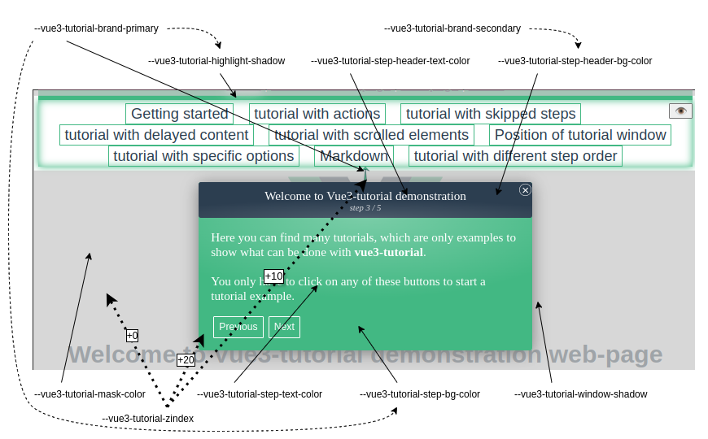

# CSS customization

[Back to main page](./main.md)

## Variables

Here are the css variable that you can override to customize the look and
feel of vue3-tutorial.

 * `--vue3-tutorial-brand-primary`: Main color used for component.
 _Default value: `#42b883`_

 * `--vue3-tutorial-brand-secondary`: Secondary color used for contrast with brand primary.
 _Default value: `#2c3e50`_

 * `--vue3-tutorial-zindex`: zIndex used by popup window for the tips. It should be higher than your other components.
 _Default value: `1000`_
    * The mask will use this value.
    * The arrow will use this value + 10;
    * The pop-up window will use this value + 20;

 * `--vue3-tutorial-step-bg-color`: The background color of the step window.
 _Default value: `var(--vue3-tutorial-brand-primary)`_

 * `--vue3-tutorial-step-text-color`: The text color of step window.
 _Default value: `white`_

 * `--vue3-tutorial-step-header-bg-color`: The background color of the header of step window.
 _Default value: `var(--vue3-tutorial-brand-secondary)`_

 * `vue3-tutorial-step-header-text-color`: The text color of the header of step window.
 _Default value: `var(vue3-tutorial-step-text-color)`_

 * `vue3-tutorial-window-shadow`: The shadow style of the popup-window.
 _Default value: `2px 5px 15px black`_

 * `--vue3-tutorial-highlight-shadow`: The shadow style of the highlighted element.
 _Default value: `0 0 10px var(--vue3-tutorial-brand-primary), inset 0 0 10px var(--vue3-tutorial-brand-primary)`_

 * `--vue3-tutorial-mask-color`: The fill color of the mask.
 _Default value: `#c8c8c8bb`_



### Usage

To override a css variable you only have to redefine it in a more specific
context (these variables are declared in `:root`).

Example:

```css
body {
    --vue3-tutorial-brand-primary: blue;
}
```

## Class

If you want to change element position, then you should change the class of
these elements.

Here are some of these class (to have the complete list, you should read the
code).

* `vue3-tutorial__window`: is related to the floating window.
* `vue3-tutorial__step`: is more related to the step content.
* `vue3-tutorial-highlight`: is a class added on the main element of the
current step. Its purpose is to highlight it.
_It is added on an element or your app._
* `vue3-tutorial__target`: is a class added on all important element of the
current step. It is currently not used by vue3-tutorial, but may help you to
identify (or style) which elements are currently used by the step.
_It is added on an element or your app._
* `vue3-tutorial__main-target`: is a class added on the main element of the
current step. It is currently not used by vue3-tutorial, but may help you to
identify (or style) which elements need interaction for the current step.
_It is added on an element or your app._
* `vue3-tutorial__mask`: is the SVG mask to give more focus to important elements.

You can also add your own class to the targeted elements with the option
`classForTargets`. Read its [documentation](./configuration.md#classForTargets)
for more details.

### Markdown

The text content displayed in the window can be formatted with markdown.
CSS class are added to this text. You can format it as you want.

[For more information about Markdown code.](./markdown.md)

* `vue3-tutorial-md-chunk`: a part of the text split. It will contain text and
some other markdown elements.
* `vue3-tutorial-md-bold`: text to be displayed bolded.
* `vue3-tutorial-md-italic`: text to be displayed in italic.
* `vue3-tutorial-md-image`: an image (``).
* `vue3-tutorial-md-link`: a link (`<a>`).
* `vue3-tutorial-md-h1`: a header level1 (`<h1>`).
* `vue3-tutorial-md-h2`: a header level2 (`<h2>`).
* `vue3-tutorial-md-h3`: a header level3 (`<h3>`).
* `vue3-tutorial-md-h4`: a header level4 (`<h4>`).
* `vue3-tutorial-md-h5`: a header level5 (`<h5>`).
* `vue3-tutorial-md-h6`: a header level6 (`<h6>`).
* `vue3-tutorial-md-hr`: an horizontal line (`<hr>`).
* `vue3-tutorial-md-strike`: text to be stroked.
* `vue3-tutorial-md-inline-code`: text to be considered as inline code.
* `vue3-tutorial-md-multiline-code`: text to be considered as multi-lines code (applied on `<pre>`).
    * `language-XXX`: for multi-lines code the language is described with this class (applied on `<code>`).
* `vue3-tutorial-md-sup`: a superscript text (`<sup>`).
* `vue3-tutorial-md-sub`: a subscript text (`<sub>`).
* `vue3-tutorial-md-ul`: an unordered list (`<ul>`).
* `vue3-tutorial-md-ol`: an ordered list (`<ol>`).
* `vue3-tutorial-md-li`: a list item (`<li>`).
* `vue3-tutorial-md-color`: a span which expect to change the color text. The color value is provided by the CSS variable `--color`.
* `vue3-tutorial-md-table`: a table (`<table>`)
* `vue3-tutorial-md-tr`: a row (`<tr>`)
* `vue3-tutorial-md-th`: a header cell (`<th>`)
* `vue3-tutorial-md-td`: a cell (`<td>`)
* `vue3-tutorial-md-quote`: a quote.

#### Special quotes

For special quotes, there are variables which define the used colors.

Class name | Variable Name                          | purpose
---------- | -------------------------------------- | -----------------------
info       | `--vue3-tutorial-info-text-color`      | change text color
info       | `--vue3-tutorial-info-border-color`    | change border color
info       | `--vue3-tutorial-info-bg-color`        | change background color
warning    | `--vue3-tutorial-warning-text-color`   | change text color
warning    | `--vue3-tutorial-warning-border-color` | change border color
warning    | `--vue3-tutorial-warning-bg-color`     | change background color
danger     | `--vue3-tutorial-danger-text-color`    | change text color
danger     | `--vue3-tutorial-danger-border-color`  | change border color
danger     | `--vue3-tutorial-danger-bg-color`      | change background color
