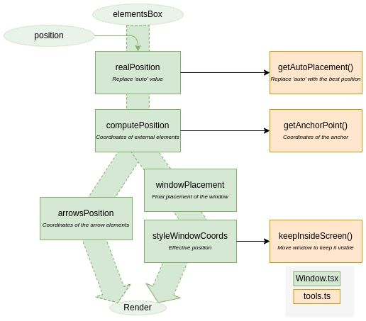

# Code Documentation: Window position

[Back to main page](./main.md)

:wrench: **Code Documentation: This page is a technical reference for developers working on the project. It is not a configuration guide.**

When props `elementsBox` is changed (meaning there are changes in the DOM),
`realPosition` is re-evaluated.
`realPosition` re-evaluate the position if the value is `auto` (`position`
should be changed only when step is changed).

First, `computePosition` is evaluated to find the best anchor coordinates
related to the target element.
_The "anchor" is the point to which elements like the arrow or window are pointing to._

From this value, arrow coordinates and window coordinates are evaluated.

The window should always be visible inside the screen.

## Position choice

When `position` option is `'auto'`.

The position will depend on the available space around the target.

**case 1**: the window is smaller than the target

**case 2**: the window is greater than the target and there is enough space
around

**case 3 & 4**: the window is greater than the target but there is not enough
space to display the window at a side direction (left/right/top/bottom).

**case 5**: There is not enough space around the target.

First we check the _case 1_ if any position fits. Then we check next _case_
until _case 5_.

For each case, the position is checked with this order `bottom`, `top`,
`right` and finally `left`.

### multiple targets

:warning: _**This is not handle yet.**_

What is expected:

If the window can be placed (regarding previous rules) without overlapping then choose this placement.

If no placements match choose a placement considering only main target.

If there is still no matching placement, choose the `center` placement.
